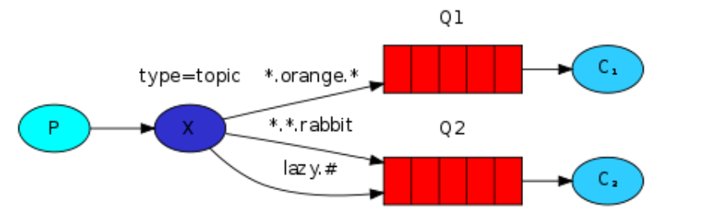

# RabbitMQ 架构

[RabbitMQ 官网](https://www.rabbitmq.com/getstarted.html)

## RabbitMQ 模式

### Hello World


P 为消息的生产者 -- producer

queue 是消息缓冲区，许多生产者可以将消息发送到同一个队列，许多消费者可以尝试从队列中接收数据。queue 有一个元信息 -- queue_name

C 为消息的消费者 -- consumer

### Work Queues

#### 循环调度

默认情况下，RabbitMQ 会将每条消息按顺序发送给下一个消费者。平均而言，每个消费者都会收到相同数量的消息。这种分发消息的方式称为循环。

#### 消息确认

执行一项任务可能需要几秒钟，您可能想知道如果消费者开始一项较长的任务并在完成之前终止会发生什么。使用我们当前的代码，一旦 RabbitMQ 将消息传递给消费者，它会立即将其标记为删除。在这种情况下，如果您终止一个 worker，它刚刚处理的消息就会丢失。发送给该特定工作人员但尚未处理的消息也会丢失。但是我们不想丢失任何任务。如果一名Consumer死亡，我们希望将任务交付给另一名Consumer。

为了确保消息永不丢失，RabbitMQ 支持 [消息*确认*](https://www.rabbitmq.com/confirms.html)。消费者发回一个 ack（知识）告诉 RabbitMQ 一个特定的消息已经被接收、处理并且 RabbitMQ 可以自由删除它。

如果一个消费者在没有发送 ack 的情况下死亡（它的通道关闭，连接关闭，或者 TCP 连接丢失），RabbitMQ 将理解消息没有被完全处理并将重新排队。如果同时有其他消费者在线，它会很快重新投递给另一个消费者。这样你就可以确保没有消息丢失，即使Consumer偶尔死亡。

#### 公平派遣

您可能已经注意到，调度仍然不能完全按照我们的意愿进行。比如有两个worker的情况，当奇数消息都重，偶数消息都轻时，一个worker会一直很忙，另一个worker几乎不做任何工作。好吧，RabbitMQ 对此一无所知，仍然会均匀地分发消息。

发生这种情况是因为 RabbitMQ 只是在消息进入队列时分派消息。它不会查看消费者未确认消息的数量。它只是盲目地将每条第 n 条消息发送给第 n 个消费者。

为了解决它，我们可以将预取计数设置为1。这告诉 RabbitMQ 一次不要给一个 worker 一个以上的消息。或者，换句话说，在 worker 处理并确认前一条消息之前，不要向它发送新消息。相反，它将把它分派给下一个还不忙的工人。

```go
    // 设置公平派遣
    ch.Qos(
        1,     // prefetch count = 1, 在worker处理并确认一条信息之前，不要向它发送新的信息。应该把它派发给不忙的worker
        0,     // prefetch size
        false, // global
    )
    failOnError(err, "Failed to set QoS")
```

### Publish/Subscribe


#### Producer

生产者创建交换机并且产生消息：

```go
err := ch.ExchangeDeclare(
    "logs", // Exchange Name
    "fanout", // Exchange type
    true, // durable 是否持久化
    false, // 自动删除
    false, // internel
    false, // no-wait
    nil, // args
)

failOnError(err, "Failed to declare an exchange")

ctx, cancel := context.WithTimeout(context.Background(), 5*time.Second)
defer cancel()

body := "Hello world! Fanout!"
err = ch.PublishWithContext(
    ctx,
    "logs", // exchange
    "",     // routing key, messages are routed to the queue with the name specified by routing_key parameter, if it exists.
    false,  // mandatory
    false,  // immediate
    amqp.Publishing{
        ContentType: "text/plain",
        Body:        []byte(body),
    })
failOnError(err, "Failed to publish a message")
```

* Exchange 有几种交换类型可用：`direct` 、`topic` 、`headers` 、`fanout` 

#### Consumer

消费者创建队列并绑定到交换机，然后消费消息：

```go
q, err := ch.QueueDeclare(
   "",   // name, 随机产生队列的名字，比如amq.gen-JzTY20BRgKO-HjmUJj0wLg
  false, // durable 持久化
  false, // delete when unused
  true,  // exclusive，独占的。当连接关闭时，队列将被删除
  false, // no-wait 
  nil,   // arguments 
)

err = ch.QueueBind( 
  q.Name, // 队列名称。比如此时的队列名称就是随机名称，如amq.gen-JzTY20BRgKO-HjmUJj0wLg
  "" ,    // routing key, 路由健
  "logs", // exchange name
  false,
  nil, 
)

msgs, err := ch.Consume(
    q.Name, // queue 队列名字
    "",     // consumer 
    true,   // auto-ack 这里不需要返回确认消息
    false,  // exclusive
    false,  // no-local
    false,  // no-wait
    nil,    // args
)
failOnError(err, "Failed to register a consumer")
```

经过测试，以上配置在启动生产者后，如果没有启动消费者，那么这段时间生产者生产的消息就会丢失。

### Routing


在此设置中，我们可以看到直接交换器X绑定了两个队列。第一个队列绑定了绑定键orange，第二个队列有两个绑定，一个绑定键为black ，另一个绑定为green。

在这样的设置中，发布到带有路由键 orange的交换器的消息将被路由到队列Q1。路由键为黑色 或绿色的消息将转到Q2。所有其他消息将被丢弃。


使用相同的绑定键绑定多个队列是完全合法的。在我们的示例中，我们可以使用绑定键black在X和Q1之间添加绑定。在这种情况下，直接交换将表现得像扇出并将消息广播到所有匹配的队列。路由键为black的消息将同时传递给 Q1和Q2。

#### Producer

生产者声明Exchange并生产消息：

* 声明Exchange的时候使用了direct这个类型，direct type 将队列的routing key 和生产的消息的 routine key 进行直接比较。如果相同，就让消息入队，如果不同，那么就不入队。

* 消费者在生产消息的时候需要声明：要发送到的Exchange的名字，消息的routing key。

```go
err = ch.ExchangeDeclare(
        "logs_direct", // name
        "direct",      // type
        true,          // durable
        false,         // auto-deleted
        false,         // internal
        false,         // no-wait
        nil,           // arguments
    )
    failOnError(err, "Failed to declare an exchange")

    ctx, cancel := context.WithTimeout(context.Background(), 5*time.Second)
    defer cancel()

    // body := "Hello world! Routing!"
    body := fmt.Sprintf("Routing key %s", routingKey)
    err = ch.PublishWithContext(
        ctx,
        "logs_direct", // exchange
        routingKey,    // routing key
        false,         // mandatory
        false,         // immediate
        amqp.Publishing{
            ContentType: "text/plain",
            Body:        []byte(body),
        })
    failOnError(err, "Failed to publish a message")
```

#### Consumer

消费者声明queue，然后将 Exchange 与 queue 绑定在一起，然后设置 queue 的 routing key。然后消费消息。

```go
q, err := ch.QueueDeclare(
        "",    // name, 随机名字
        false, // durable
        false, // delete when unused
        true,  // exclusive
        false, // no-wait
        nil,   // arguments
    )
    failOnError(err, "Failed to declare a queue")

    err = ch.QueueBind(
        q.Name,        // queue name
        routingKey,    // routing key
        "logs_direct", // exchange
        false,
        nil,
    )
    failOnError(err, "Failed to bind a queue")

    msgs, err := ch.Consume(
        q.Name, // queue
        "",     // consumer
        true,   // auto ack
        false,  // exclusive
        false,  // no local
        false,  // no wait
        nil,    // args
    )
    failOnError(err, "Failed to register a consumer")
```

### Topics

#### Producer

发送到 Topics 交换的消息不能有任意的 routing_key - 它必须是一个单词列表，由点分隔。词可以是任何东西，但通常它们指定与消息相关的一些特征。一些有效的路由键示例：“ stock.usd.nyse ”、“ nyse.vmw ”、“ quick.orange.rabbit ”。路由键中的单词可以有任意多个，最多不超过 255 个字节。

绑定密钥也必须采用相同的形式。Topics 交换背后的逻辑 类似于 direct 交换——使用特定路由键发送的消息将被传递到与匹配绑定键绑定的所有队列。然而，绑定键有两个重要的特殊情况：

- *(星号) 只能代替一个词。
- #(hash) 可以替代零个或多个单词。



```go
err = ch.ExchangeDeclare(
        "logs_topic", // name
        "topic",      // type
        true,         // durable
        false,        // auto-deleted
        false,        // internal
        false,        // no-wait
        nil,          // arguments
    )
    failOnError(err, "Failed to declare an exchange")

    ctx, cancel := context.WithTimeout(context.Background(), 5*time.Second)
    defer cancel()

    // body := bodyFrom(os.Args)
    body := fmt.Sprintf("Topic: routing key: %s", routingKey)
    err = ch.PublishWithContext(ctx,
        "logs_topic", // exchange
        routingKey,   // routing key
        false,        // mandatory
        false,        // immediate
        amqp.Publishing{
            ContentType: "text/plain",
            Body:        []byte(body),
        })
    failOnError(err, "Failed to publish a message")
```

#### Consumer

```go
// 声明队列
q, err := ch.QueueDeclare(
        "",    // name
        false, // durable
        false, // delete when unused
        true,  // exclusive
        false, // no-wait
        nil,   // arguments
    )
    failOnError(err, "Failed to declare a queue")

    // 将队列绑定到Exchange，设置RoutingKey
    err = ch.QueueBind(
        q.Name,       // queue name
        routingKey,   // routing key
        "logs_topic", // exchange
        false,
        nil)
    failOnError(err, "Failed to bind a queue")

    // 接收消费信息
    msgs, err := ch.Consume(
        q.Name, // queue
        "",     // consumer
        true,   // auto ack
        false,  // exclusive
        false,  // no local
        false,  // no wait
        nil,    // args
    )
    failOnError(err, "Failed to register a consumer")
```

## RabbitMQ 安装

### 使用 Docker Image

```bash
docker run -d --name my-rabbit --hostname=my-rabbit -e RABBITMQ_DEFAULT_USER=admin -e RABBITMQ_DEFAULT_PASS=admin -p 5672:5672 -p 15672:15672  rabbitmq:3-management
```

说明：

-d 后台运行容器；

--name 指定容器名；

-p 指定服务运行的端口（5672：应用访问端口；15672：控制台Web端口号）；

-v 映射目录或文件；

--hostname  主机名（RabbitMQ的一个重要注意事项是它根据所谓的 “节点名称” 存储数据，默认为主机名）；

-e 指定环境变量；（RABBITMQ_DEFAULT_VHOST：默认虚拟机名；RABBITMQ_DEFAULT_USER：默认的用户名；RABBITMQ_DEFAULT_PASS：默认用户名的密码）

## RabbitMQ 命令

* 列出 exchanges

> rabbitmqctl list_exchanges

* 列出 queues

> rabbitmqctl list_queues

* 列出 exchange 与 queue 绑定信息

> rabbitmqctl list_bindings

| Type              | Status |
| ----------------- | ------ |
| Hello World       | Done   |
| Work Queues       | Done   |
| Publish/Subscribe | Done   |
| Routing           | Done   |
| Topics            | Done   |
| RPC               |        |
